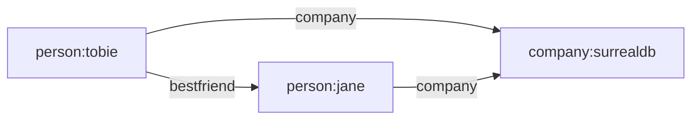
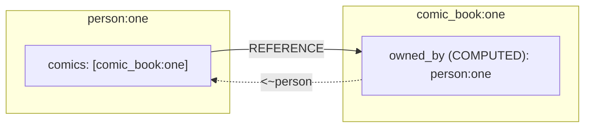

# Data Model and Multi-Model Architecture

> SurrealDB is a multi-model database that unifies document, graph, relational, time-series, geospatial, key-value, and vector data models into a single engine with a single query language (SurrealQL). This document explores how SurrealDB's data model works, what makes it unique, and how to use it effectively.

---

## Table of Contents

- [[#Overview — What "Multi-Model" Means in SurrealDB]]
- [[#The Document Model]]
- [[#Record IDs — The Universal Identifier]]
- [[#Record Links — Lightweight References]]
- [[#Record References — Bidirectional Tracking]]
- [[#Graph Relations — The RELATE Statement]]
- [[#Choosing Between Links, References, and Graph Edges]]
- [[#Embedded Objects and Arrays]]
- [[#The Type System]]
- [[#Schema Enforcement — SCHEMAFULL vs SCHEMALESS]]
- [[#Field Definitions]]
- [[#Assertions and Validations]]
- [[#Computed Fields and Dynamic Values]]
- [[#Comparison with Other Multi-Model Databases]]
- [[#Conceptual Architecture Diagram]]
- [[#Key Takeaways]]

---

## Overview — What "Multi-Model" Means in SurrealDB

Most databases are designed around a single data model: relational (PostgreSQL), document (MongoDB), graph (Neo4j), or key-value (Redis). Applications that need multiple models typically run multiple databases and synchronize data between them — the "polyglot persistence" pattern.

SurrealDB takes a different approach. It implements multiple data models in a **single engine** with a **single query language**. There is no separate graph module or document plugin. Every record is simultaneously:

- A **document** (JSON-like nested structure)
- A **node** in a graph (addressable by Record ID, linkable to any other record)
- A **row** in a table (queryable with SQL-like syntax)

This is not a layer cake where one model sits on top of another. SurrealDB's underlying storage is a key-value layer (backed by RocksDB, SurrealKV, or in-memory), and all data models are projections of the same stored data.

```
                    SurrealQL (Unified Query Language)
                              |
          +-------------------+-------------------+
          |                   |                   |
     Document Model     Graph Model      Relational Model
     (nested JSON,      (RELATE,         (tables, fields,
      flexible schema)   edges, traverse)  indexes, JOINs)
          |                   |                   |
          +-------------------+-------------------+
                              |
                    Key-Value Storage Layer
                  (RocksDB / SurrealKV / Memory)
```

### Supported Data Models

| Model | How SurrealDB Implements It |
|---|---|
| **Document** | Records are JSON-like objects with nested fields, arrays, objects |
| **Graph** | `RELATE` creates edge tables; arrow syntax traverses relationships |
| **Relational** | Tables with defined fields, types, indexes, constraints |
| **Time-series** | Array-based Record IDs with datetime components enable natural time ordering |
| **Vector** | `array<float>` fields with HNSW indexes for similarity search |
| **Geospatial** | Native `geometry` type (GeoJSON) with spatial operations |
| **Key-value** | Direct record access via `table:id` is effectively a key-value lookup |
| **Full-text search** | Analyzers + BM25 indexes on string fields |

---

## The Document Model

At its core, every record in SurrealDB is a document — a JSON-like object that can contain:

- Scalar values (strings, numbers, booleans, datetimes, durations, UUIDs)
- Nested objects (unlimited depth)
- Arrays and sets
- Record links (references to other records)
- Computed fields
- Geometries and binary data

### Creating Documents

```surql
-- Simple document
CREATE person:tobie SET
    name = "Tobie Morgan Hitchcock",
    age = 35,
    interests = ["databases", "rust", "surfing"];

-- Nested document
CREATE person:jane SET
    name = {
        first: "Jane",
        last: "Doe"
    },
    address = {
        street: "123 Main St",
        city: "London",
        geo: (51.5074, -0.1278)   -- geometry point
    },
    tags = ["engineer", "writer"];

-- Document with CONTENT (entire body)
CREATE article:intro CONTENT {
    title: "Getting Started with SurrealDB",
    body: "SurrealDB is a multi-model database...",
    metadata: {
        published: true,
        created_at: time::now(),
        word_count: 1500
    },
    tags: ["tutorial", "beginner"]
};
```

### Querying Nested Fields

SurrealDB uses dot notation to access nested fields, and bracket notation for arrays:

```surql
-- Access nested object field
SELECT name.first FROM person;

-- Access array element
SELECT tags[0] FROM article;

-- Access nested field inside array of objects
SELECT ratings[*].score FROM film;

-- Destructure with aliases
SELECT
    name.first AS first_name,
    address.city AS city
FROM person;
```

---

## Record IDs — The Universal Identifier

Record IDs are foundational to SurrealDB's multi-model architecture. Every record has a unique ID in the format `table:key`, which serves as:

- A primary key (like SQL)
- A document ID (like MongoDB's `_id`)
- A node identifier in the graph
- A direct-access key (like Redis)

### Record ID Format

```
table_name:key_value
    |           |
    |           +-- Unique identifier within the table
    +------------- Table the record belongs to
```

### Types of Record ID Keys

SurrealDB supports remarkably flexible key types:

| Key Type | Example | Use Case |
|---|---|---|
| **Random** (default) | `person:ezs644u19mae2p68404j` | General purpose, auto-generated |
| **String** | `person:tobie` | Human-readable, application-defined |
| **Integer** | `temperature:17493` | Sequential data, counters |
| **UUID** | `person:⟨018f39c4-b138-7fb4-...⟩` | Distributed systems, external IDs |
| **Array** | `weather:['London', d'2025-02-14']` | Composite keys, time-series |
| **Object** | `sensor:{ region: 'EU', id: 42 }` | Structured composite keys |
| **ULID** | Generated via `ulid()` | Time-sortable unique IDs |

### Examples

```surql
-- Random ID (auto-generated)
CREATE person;
-- Result: person:w6xb3izpgvz4n0gow6q7

-- String ID
CREATE company:surrealdb SET name = "SurrealDB Ltd";

-- Integer ID
CREATE temperature:17493 SET celsius = 37.5, time = time::now();

-- UUID ID
CREATE user:u"018f39c4-b138-7fb4-b0f4-9281c5a9e213" SET name = "Alice";

-- Array-based composite ID (time-series)
LET $now = time::now();
CREATE temperature:['London', $now] SET
    location = 'London',
    date = time::round($now, 1h),
    temperature = 23.7;

-- Object-based composite ID
CREATE reading:{ region: 'EU', sensor: 42, ts: time::now() } SET
    value = 98.6;

-- Generated IDs
CREATE event:ulid() SET name = "Conference";
CREATE session:uuid() SET started = time::now();
CREATE counter:rand() SET value = 0;
```

### Record ID Ranges

Array-based record IDs naturally sort, enabling efficient range queries:

```surql
-- Query a range of time-series data
SELECT * FROM temperature:['London', NONE]..=['London', d'2025-12-31'];

-- Query numeric ID ranges
SELECT * FROM log:1..=100;
```

### Defining ID Types on Tables

You can enforce what kind of ID a table accepts:

```surql
-- Only allow integer IDs
DEFINE FIELD id ON temperature TYPE number;

-- Only allow array-based IDs of [string, datetime]
DEFINE FIELD id ON reading TYPE [string, datetime];
```

---

## Record Links — Lightweight References

Record links are the simplest way to connect documents. A field stores another record's ID, creating a unidirectional pointer.



### Creating Record Links

```surql
-- Direct link via record ID
CREATE person:tobie SET
    name = "Tobie",
    bestfriend = person:jane,
    company = company:surrealdb;

-- Link to multiple records (array of record IDs)
CREATE person:tobie SET
    friends = [person:jane, person:alice, person:bob];
```

### Traversing Record Links

The key power of record links is **transparent traversal** — you can follow links using dot notation without JOINs:

```surql
-- Follow a single link
SELECT bestfriend.name FROM person:tobie;
-- Returns: { "bestfriend": { "name": "Jane" } }

-- Follow a chain of links
SELECT bestfriend.company.name FROM person:tobie;
-- Returns the company name of Tobie's best friend

-- Traverse array of links
SELECT friends.*.name FROM person:tobie;
-- Returns names of all friends

-- Deep traversal
SELECT friends.*.bestfriend.name FROM person:tobie;
-- Returns the best friend's name for each of Tobie's friends
```

### FETCH Clause

For more control, use `FETCH` to explicitly resolve links:

```surql
SELECT * FROM person FETCH bestfriend, company;
-- Returns full objects for linked records instead of just IDs
```

### Defining Typed Record Links

```surql
-- Must link to a person record
DEFINE FIELD bestfriend ON person TYPE record<person>;

-- Can link to a cat OR dog record
DEFINE FIELD pet ON user TYPE option<record<cat | dog>>;

-- Array of links to a specific table
DEFINE FIELD articles ON author TYPE array<record<article>>;
```

---

## Record References — Bidirectional Tracking

> Available since SurrealDB 2.2.0. Stabilized in SurrealDB 3.0.

Record references extend record links with **automatic bidirectional awareness**. When you define a field with `REFERENCE`, SurrealDB tracks incoming links, allowing the target record to discover who links to it.



### Defining Record References

```surql
-- The forward link: person owns comic books (with REFERENCE tracking)
DEFINE FIELD comics ON person TYPE option<array<record<comic_book>>> REFERENCE;

-- The reverse link: computed field that automatically resolves who owns this comic
DEFINE FIELD owned_by ON comic_book COMPUTED <~person;

-- Create data
CREATE comic_book:one SET title = "Loki, God of Stories";
CREATE person:one SET comics = [comic_book:one];

-- Query from the comic book side — bidirectional!
SELECT * FROM comic_book:one;
-- Returns: { id: comic_book:one, title: "...", owned_by: [person:one] }
```

### The `<~` Operator

The `<~` operator queries **incoming references** — records that link TO the current record:

```surql
-- Find all users who reference this comment
SELECT text, <~user.id[0] AS commenter FROM comment;

-- Find all licenses owned by a person (reverse traversal)
SELECT name, (SELECT type, since FROM <~license ORDER BY since) AS licenses
FROM person;
```

### Reference Deletion Behaviors

```surql
-- Default: referencing field is set to NONE when target is deleted
DEFINE FIELD comics ON person TYPE option<array<record<comic_book>>> REFERENCE;

-- UNSET: remove the reference from the array
DEFINE FIELD comments ON person TYPE option<array<record<comment>>>
    REFERENCE ON DELETE UNSET;

-- CASCADE: delete the parent record when the child is deleted
DEFINE FIELD author ON article TYPE record<person>
    REFERENCE ON DELETE CASCADE;

-- REJECT: prevent deletion of referenced records
DEFINE FIELD author ON comment TYPE option<record<person>>
    REFERENCE ON DELETE REJECT;

-- THEN: run a custom expression
DEFINE FIELD owner ON license TYPE record<person>
    REFERENCE ON DELETE THEN { /* custom cleanup logic */ };
```

---

## Graph Relations — The RELATE Statement

Graph relations are the most powerful relationship type. They create **edge records** — full-fledged records stored in their own table — that connect two nodes and can carry metadata.

```mermaid
graph LR
    P[person:billy] -->|"order (edge)"| O[order:ulid]
    O -->|""| PR[product:laptop]

    style O fill:#f9f,stroke:#333,stroke-width:2px
```

### Basic RELATE Syntax

```surql
-- Create a graph edge
RELATE person:tobie->wrote->article:surreal SET
    time.written = time::now();

-- The edge record has an implicit structure:
-- {
--   id: wrote:random_id,
--   in: person:tobie,      -- the source node
--   out: article:surreal,  -- the target node
--   time: { written: "2025-..." }
-- }
```

### Key Characteristics of Graph Edges

1. **Edges are real tables** — they can have fields, indexes, and permissions
2. **Edges have `in` and `out` fields** — automatically set by `RELATE`
3. **Edges are deleted when empty** — no orphan edge tables
4. **Bidirectional querying by default** — define once, traverse both ways

### Creating Rich Edges

```surql
-- E-commerce order with metadata pulled from linked records
RELATE person:billy->order->product:laptop CONTENT {
    quantity: 2,
    product_name: ->product.name,       -- pull from target (product)
    price: ->product.price,             -- pull from target
    shipping_address: <-person.address, -- pull from source (person)
    order_date: time::now(),
    status: "pending",
    payment_method: "PayPal"
};

-- Multiple relationships at once
RELATE person:tobie->likes->[article:one, article:two, article:three];

-- Relationship from query results
LET $devs = SELECT * FROM user WHERE role CONTAINS 'developer';
RELATE company:surrealdb->employs->$devs SET
    hired_at = time::now();
```

### Graph Traversal with Arrow Syntax

The arrow operator `->` and `<-` traverses graph edges:

```surql
-- Forward traversal: what did Tobie write?
SELECT ->wrote->article.* FROM person:tobie;

-- Backward traversal: who wrote this article?
SELECT <-wrote<-person.name FROM article:surreal;

-- Multi-hop traversal: friends of friends
SELECT ->knows->person->knows->person.name FROM person:tobie;

-- Wildcard edge type: all outgoing relationships
SELECT ->(?).* AS what_tobie_did FROM person:tobie;

-- All incoming relationships
SELECT <-(?).* AS what_others_did_to_tobie FROM person:tobie;

-- Filtered traversal with conditions
SELECT
    ->knows->(? WHERE age > 30 AS older_friends)
        ->knows->(? AS their_friends)
FROM person:tobie;
```

### Arrow Direction Reference

| Syntax | Direction | Meaning |
|---|---|---|
| `->edge->target` | Forward | Follow outgoing edges |
| `<-edge<-source` | Backward | Follow incoming edges |
| `<->edge<->any` | Bidirectional | Follow edges in either direction |
| `->(?)->target` | Wildcard | Follow any edge type |

### Defining Edge Tables

```surql
-- Define an edge table with TYPE RELATION for type safety
DEFINE TABLE wrote TYPE RELATION
    FROM person
    TO article | book
    SCHEMAFULL;

DEFINE FIELD written_at ON wrote TYPE datetime DEFAULT time::now();
DEFINE FIELD mood ON wrote TYPE option<string>;

-- Now RELATE will enforce that 'in' must be a person
-- and 'out' must be an article or book
RELATE person:tobie->wrote->article:intro SET
    mood = "inspired";
```

---

## Choosing Between Links, References, and Graph Edges

```
                    Relationship Complexity
    Simple ──────────────────────────────── Rich

    Record Links     Record References     Graph Edges
    ────────────     ────────────────      ──────────
    - Unidirectional - Bidirectional       - Bidirectional
    - No metadata    - No metadata         - Full metadata
    - Field on       - Field on record     - Separate table
      record           + COMPUTED reverse  - Own indexes
    - Fastest        - Schema-managed      - Most flexible
    - Dot traversal  - <~ operator         - Arrow traversal
```

| Feature | Record Links | Record References | Graph Edges |
|---|---|---|---|
| Direction | Unidirectional | Bidirectional | Bidirectional |
| Metadata on relationship | No | No | Yes (full table) |
| Storage | Field in source record | Field + reverse tracking | Separate edge table |
| Traversal syntax | `field.name` | `field.name` or `<~table` | `->edge->table` |
| Schema definition | `DEFINE FIELD ... TYPE record<T>` | `... TYPE record<T> REFERENCE` | `DEFINE TABLE ... TYPE RELATION` |
| Deletion behavior | Manual | Configurable (CASCADE, REJECT, etc.) | Edge deleted with record |
| Best for | Simple foreign keys | Ownership, parent-child | Actions, events, social graphs |
| Available since | v1.0 | v2.2 (stable in v3.0) | v1.0 |

### Decision Guide

- **Use Record Links** when you have a simple "belongs to" or "has one" relationship and do not need to traverse backwards.
- **Use Record References** when you need bidirectional awareness but the relationship itself carries no data (e.g., "a person owns comic books, and a comic book knows its owner").
- **Use Graph Edges** when the relationship itself is meaningful — it has metadata, timestamps, scores, or you need multi-hop traversal (e.g., "person ordered product with quantity, price, shipping info").

---

## Embedded Objects and Arrays

SurrealDB natively supports complex nested data structures without flattening.

### Objects

```surql
CREATE person SET
    name = {
        first: "Tobie",
        last: "Morgan Hitchcock"
    },
    address = {
        street: "1 Bagshot Row",
        city: "London",
        country: "UK",
        coordinates: {
            lat: 51.5074,
            lng: -0.1278
        }
    };

-- Access nested fields
SELECT name.first, address.coordinates.lat FROM person;
```

### Arrays

```surql
CREATE film:matrix SET
    title = "The Matrix",
    genres = ["sci-fi", "action"],
    ratings = [
        { score: 9, user: person:neo },
        { score: 10, user: person:trinity },
        { score: 8, user: person:morpheus }
    ];

-- Array operations
SELECT ratings[0].score FROM film:matrix;        -- First rating
SELECT ratings[*].score FROM film:matrix;         -- All scores
SELECT ratings[WHERE score > 8] FROM film:matrix; -- Filtered
SELECT array::len(genres) FROM film:matrix;       -- Length
```

### Sets

Sets are like arrays but automatically **deduplicate** and **sort** values:

```surql
DEFINE FIELD tags ON article TYPE set<string>;

CREATE article:one SET tags = ["rust", "database", "rust", "graph"];
-- Stored as: ["database", "graph", "rust"]  (deduplicated + sorted)

DEFINE FIELD tags ON person TYPE set<string, 5>;
-- Maximum 5 unique tags
```

### Literal Types (Enum-like)

```surql
-- A field that only accepts specific string values
DEFINE FIELD status ON order TYPE "pending" | "shipped" | "delivered" | "cancelled";

-- Literal objects (discriminated unions)
DEFINE FIELD event ON log TYPE
    { type: "login", ip: string }
  | { type: "purchase", amount: decimal }
  | { type: "logout" };
```

---

## The Type System

SurrealDB has a comprehensive, strongly-typed system. Types are enforced at the field level when using `SCHEMAFULL` tables.

### Complete Type Reference

| Type | Description | Example |
|---|---|---|
| `any` | Accepts any type | `DEFINE FIELD data ON t TYPE any` |
| `null` | Null value only | Used internally |
| `bool` | Boolean | `true`, `false` |
| `int` | 64-bit signed integer | `42`, `-17` |
| `float` | 64-bit floating point | `3.14`, `2.0` |
| `decimal` | Arbitrary precision decimal | `0.1 + 0.2 = 0.3` (exact) |
| `number` | Auto-detected numeric (int, float, or decimal) | `42` or `3.14` |
| `string` | UTF-8 text | `"hello world"` |
| `datetime` | RFC 3339 date+time (stored as UTC) | `d"2025-02-23T12:00:00Z"` |
| `duration` | Time span (nanoseconds to weeks) | `1h30m`, `7d`, `500ms` |
| `uuid` | UUID (v4, v7 supported) | `u"018f39c4-b138-..."` |
| `bytes` | Binary data | `<bytes>"SGVsbG8"` |
| `regex` | Compiled regular expression | `/^[a-z]+$/` |
| `record` | Reference to another record | `record<person>` |
| `option<T>` | Optional — NONE or T | `option<string>` |
| `array<T>` | Ordered collection | `array<string>`, `array<int, 10>` |
| `set<T>` | Deduplicated, sorted collection | `set<string, 5>` |
| `object` | Key-value map | Nested JSON-like |
| `geometry` | GeoJSON types | `geometry<point>`, `geometry<polygon>` |
| `range` | Range of values | `0..10`, `'a'..'z'` |
| `literal` | Specific allowed values (enum) | `"a" \| "b" \| "c"` |
| `file` | File reference (with optional bucket) | `file<images>` |
| `function` | Callable function type | Used for closures |

### Union Types

Fields can accept multiple types:

```surql
-- Accept either float or decimal
DEFINE FIELD rating ON film TYPE float | decimal;

-- Accept a record link to cat OR dog
DEFINE FIELD pet ON user TYPE option<record<cat | dog>>;

-- Complex union
DEFINE FIELD value ON measurement TYPE int | float | string;
```

### Type Casting

Explicit type conversion using angle bracket syntax:

```surql
UPDATE person SET
    waist = <int>"34",              -- string to int
    height = <float>201,            -- int to float
    score = <decimal>0.3 + 0.3 + 0.3 + 0.1;  -- exact decimal math

-- Prefix-based parsing (compile-time checks)
RETURN d'2025-02-23T12:00:00Z';   -- d prefix = datetime
RETURN r'person:tobie';            -- r prefix = record ID
RETURN u'018f39c4-b138-7fb4...';   -- u prefix = UUID
```

### Type Checking Functions

```surql
-- Runtime type checking
RETURN type::of(42);           -- "int"
RETURN type::of("hello");      -- "string"
RETURN type::is_int(42);       -- true
RETURN type::is_string(42);    -- false

-- Type conversion functions
RETURN type::int("42");        -- 42
RETURN type::string(42);       -- "42"
RETURN type::datetime("2025-02-23");
RETURN type::bool("true");
```

---

## Schema Enforcement — SCHEMAFULL vs SCHEMALESS

SurrealDB offers two schema modes per table, and you can mix them in the same database.

### SCHEMALESS (Default)

```surql
-- Schemaless table (default behavior)
DEFINE TABLE user SCHEMALESS;

-- Any fields can be added — no restrictions
CREATE user:one SET
    name = "Alice",
    age = 30,
    arbitrary_field = "this is fine",
    nested = { anything: "goes" };
```

- Fields do not need to be predefined
- Any data structure is accepted
- You CAN still define fields with types — they act as validation for those specific fields while allowing other fields to pass through
- Best for: rapid prototyping, flexible schemas, content storage

### SCHEMAFULL

```surql
-- Schemafull table — only defined fields are stored
DEFINE TABLE user SCHEMAFULL;
DEFINE FIELD firstName ON user TYPE string;
DEFINE FIELD lastName ON user TYPE string;
DEFINE FIELD email ON user TYPE string
    ASSERT string::is_email($value);

-- This succeeds (all fields defined)
CREATE user CONTENT {
    firstName: "Tobie",
    lastName: "Hitchcock",
    email: "tobie@surrealdb.com"
};

-- The `photoURI` field is silently dropped (not defined)
CREATE user CONTENT {
    firstName: "Jane",
    lastName: "Doe",
    email: "jane@example.com",
    photoURI: "photo/abc.webp"  -- IGNORED
};
```

- Only defined fields are stored
- Undefined fields are silently dropped
- All defined field types are strictly enforced
- Best for: production systems, data integrity, APIs

### FLEXIBLE — The Hybrid

The `FLEXIBLE` keyword on a field within a `SCHEMAFULL` table allows that specific field to accept any structure:

```surql
DEFINE TABLE event SCHEMAFULL;
DEFINE FIELD name ON event TYPE string;
DEFINE FIELD timestamp ON event TYPE datetime;

-- This field can hold any JSON-like structure
DEFINE FIELD metadata ON event TYPE object FLEXIBLE;

CREATE event SET
    name = "deploy",
    timestamp = time::now(),
    metadata = {
        version: "3.0.0",
        region: "us-east-1",
        custom_data: [1, 2, 3],
        nested: { anything: true }
    };
```

### How Objects Behave in Each Mode

| Context | Object Behavior |
|---|---|
| `SCHEMALESS` table, `TYPE object` | Object is schemaless (any keys) |
| `SCHEMALESS` table, `TYPE { a: string }` | Object is schemafull (literal type) |
| `SCHEMAFULL` table, `TYPE object` | Object is schemafull (sub-fields must be defined) |
| `SCHEMAFULL` table, `TYPE object FLEXIBLE` | Object is schemaless |

---

## Field Definitions

The `DEFINE FIELD` statement is the primary tool for schema definition. It supports a rich set of clauses.

### Full Syntax

```surql
DEFINE FIELD [OVERWRITE | IF NOT EXISTS] @name ON [TABLE] @table
    [TYPE @type [FLEXIBLE]]
    [REFERENCE [ON DELETE REJECT|CASCADE|IGNORE|UNSET|THEN @expr]]
    [DEFAULT [ALWAYS] @expression]
    [READONLY]
    [VALUE @expression]
    [ASSERT @expression]
    [PERMISSIONS [...]]
    [COMMENT @string]
```

### DEFAULT vs VALUE

These two clauses serve different purposes:

```surql
-- DEFAULT: evaluated once when record is created (if field is not provided)
DEFINE FIELD created_at ON person TYPE datetime DEFAULT time::now();

-- VALUE: evaluated every time the record is created or updated
DEFINE FIELD updated_at ON person TYPE datetime VALUE time::now();

-- DEFAULT ALWAYS: always apply the default, even if a value is provided
DEFINE FIELD id_normalized ON person TYPE string
    DEFAULT ALWAYS string::lowercase(name);
```

| Clause | When Evaluated | Can Be Overridden |
|---|---|---|
| `DEFAULT` | On CREATE if field is empty | Yes |
| `DEFAULT ALWAYS` | On CREATE, always | No |
| `VALUE` | On every CREATE and UPDATE | No |

### READONLY Fields

```surql
-- Once set, cannot be changed
DEFINE FIELD created_at ON user VALUE time::now() READONLY;
DEFINE FIELD created_by ON document TYPE record<user> READONLY;

-- Also useful for formatted output fields
DEFINE FIELD since ON user VALUE time::format(created_at, "%Y-%m-%d");
```

### Nested Field Definitions

```surql
DEFINE TABLE user SCHEMAFULL;
DEFINE FIELD name ON user TYPE object;
DEFINE FIELD name.first ON user TYPE string;
DEFINE FIELD name.last ON user TYPE string;
DEFINE FIELD address ON user TYPE object;
DEFINE FIELD address.street ON user TYPE string;
DEFINE FIELD address.city ON user TYPE string;
DEFINE FIELD address.geo ON user TYPE option<geometry<point>>;
```

### Cross-Field References

Field definitions can reference other fields on the same record:

```surql
DEFINE TABLE person SCHEMAFULL;
DEFINE FIELD first_name ON person TYPE string
    ASSERT string::len($value) < 20;
DEFINE FIELD last_name ON person TYPE string
    ASSERT string::len($value) < 20;

-- Computed from other fields
DEFINE FIELD name ON person VALUE first_name + ' ' + last_name;

-- Creates "Bob Bobson" automatically
CREATE person SET first_name = "Bob", last_name = "Bobson";
```

---

## Assertions and Validations

The `ASSERT` clause validates field values before they are stored. Assertions have access to `$value` (the new value), `$before` (the previous record state), and `$after` (the new record state).

### Basic Assertions

```surql
-- Email validation
DEFINE FIELD email ON user TYPE string
    ASSERT string::is_email($value);

-- Range validation
DEFINE FIELD age ON person TYPE int
    ASSERT $value >= 0 AND $value <= 150;

-- Enum-like validation
DEFINE FIELD class ON character TYPE string
    ASSERT $value IN ["warrior", "mage", "rogue"];

-- Regex validation
DEFINE FIELD countrycode ON user TYPE string
    ASSERT $value = /[A-Z]{3}/;

-- Length validation
DEFINE FIELD username ON user TYPE string
    ASSERT string::len($value) >= 3 AND string::len($value) <= 30;

-- Positive price
DEFINE FIELD price ON product TYPE decimal
    ASSERT $value > 0;
```

### Array Element Assertions

```surql
-- RGB color: array of exactly 3 integers, each 0-255
DEFINE FIELD rgb ON colour TYPE array<int, 3>;
DEFINE FIELD rgb[*] ON colour TYPE int ASSERT $value IN 0..=255;
```

### Custom Error Messages with THROW

```surql
DEFINE FIELD name ON person TYPE string
    ASSERT $value.len() < 20
    OR THROW "Name must be under 20 characters, got: " + <string>$value.len();

DEFINE FIELD email ON user TYPE string
    ASSERT string::is_email($value)
    OR THROW "Invalid email format: " + $value;
```

### Using $before and $after

```surql
-- Prevent downgrading a status
DEFINE FIELD status ON order TYPE string
    ASSERT $value IN ["draft", "submitted", "approved", "shipped"]
    ASSERT {
        LET $order = ["draft", "submitted", "approved", "shipped"];
        RETURN !$before OR array::find_index($order, $value) >=
               array::find_index($order, $before.status)
    };

-- Trigger an event on email change (via table events, not assertions)
DEFINE EVENT email ON TABLE user
    WHEN $before.email != $after.email
    THEN (
        CREATE event SET
            user = $this,
            time = time::now(),
            value = $after.email,
            action = 'email_changed'
    );
```

---

## Computed Fields and Dynamic Values

### COMPUTED Fields (v3.0+)

`COMPUTED` fields are not stored — they are recalculated every time the record is accessed:

```surql
-- Is this person old enough to drive?
DEFINE FIELD can_drive ON person COMPUTED time::now() > birthday + 18y;

-- Is this license still valid? (computed on every read)
DEFINE FIELD valid ON license COMPUTED time::now() - since < 2y;

-- Reverse reference (who owns this record?)
DEFINE FIELD owned_by ON comic_book COMPUTED <~person;

-- Incoming licenses for a person
DEFINE FIELD licenses ON person COMPUTED <~license;

-- Usage
CREATE person:one SET birthday = d"2007-06-22";
SELECT can_drive FROM person:one;
-- Returns true or false depending on current date
```

### Differences: VALUE vs COMPUTED vs DEFAULT

```
+----------+------------------+------------+-------------------+
| Clause   | Stored on disk?  | When eval? | Recalculated on   |
|          |                  |            | SELECT?           |
+----------+------------------+------------+-------------------+
| DEFAULT  | Yes              | CREATE     | No                |
| VALUE    | Yes              | CREATE,    | No                |
|          |                  | UPDATE     |                   |
| COMPUTED | No               | Every      | Yes (every time)  |
|          |                  | access     |                   |
+----------+------------------+------------+-------------------+
```

### Pre-computed Table Views

Tables can be defined as materialized views that auto-update:

```surql
-- Automatically maintained aggregate view
DEFINE TABLE monthly_sales AS
    SELECT
        count() AS total_orders,
        math::sum(price) AS total_revenue,
        time::group(order_date, 'month') AS month
    FROM order
    GROUP BY month;

-- Query the view like a normal table
SELECT * FROM monthly_sales;
```

---

## Comparison with Other Multi-Model Databases

### SurrealDB vs ArangoDB

| Aspect | SurrealDB | ArangoDB |
|---|---|---|
| **Query language** | SurrealQL (SQL-like) | AQL (custom) |
| **Graph model** | `RELATE` + arrow traversal | Named graphs + AQL traversal |
| **Edge storage** | Edges are real tables with data | Edges in edge collections |
| **Record IDs** | `table:key` (flexible key types) | `_key` within collections |
| **Schema modes** | SCHEMAFULL / SCHEMALESS per table | Schema validation (optional) |
| **Record references** | Built-in `REFERENCE` + `<~` | Not available |
| **Record links** | Native dot traversal | Requires explicit joins |
| **Time-series** | Array-based IDs + range queries | Generic documents |
| **Vector search** | Native HNSW indexes | Via ArangoSearch |
| **Written in** | Rust | C++ |
| **Deployment** | Single binary, embedded, WASM, distributed | Server cluster |

### SurrealDB vs Neo4j

| Aspect | SurrealDB | Neo4j |
|---|---|---|
| **Primary model** | Multi-model | Graph-only |
| **Query language** | SurrealQL | Cypher |
| **Document storage** | Native nested JSON | Properties on nodes (flat) |
| **Schema** | SCHEMAFULL / SCHEMALESS | Optional constraints |
| **Relationship metadata** | Full table with schema | Properties on relationships |
| **SQL compatibility** | High (SQL-like syntax) | None (Cypher only) |
| **Vector search** | Native | Via plugin |
| **Embedded deployment** | Yes (+ WASM) | No |

### What Makes SurrealDB's Approach Unique

1. **Records are simultaneously documents, graph nodes, and table rows** — there is no mode switching or separate APIs for different models.

2. **Record IDs as universal connectors** — the `table:key` format makes every record addressable and linkable. Array/object keys enable composite identifiers that other databases require separate index structures for.

3. **Three tiers of relationships** (links, references, graph edges) — instead of forcing everything into one relationship model, you choose the right complexity level.

4. **Schema flexibility per table** — some tables can be strict, others flexible, in the same database. The `FLEXIBLE` keyword allows schemaless islands within schemafull tables.

5. **Edges are first-class tables** — unlike graph databases where edge properties are a secondary concept, SurrealDB edges are full tables with their own schema, indexes, and permissions.

6. **Monolithic multi-model** — SurrealDB implements all models in one unified engine (unlike Polypheny which maintains separate model engines). This means cross-model queries are native, not bridged.

7. **Single binary deployment** — runs embedded (in-app), in the browser (WASM), at the edge, or as a distributed cluster, using the same data model everywhere.

---

## Conceptual Architecture Diagram

```
+------------------------------------------------------------------+
|                         SurrealQL Engine                          |
|  +--------------------+  +------------------+  +---------------+ |
|  | Document Queries    |  | Graph Traversal  |  | Relational    | |
|  | SELECT, CREATE,     |  | ->, <-, <->      |  | JOINs,        | |
|  | nested dot access   |  | RELATE, multi-hop|  | GROUP BY,     | |
|  +--------------------+  +------------------+  | aggregates    | |
|                                                 +---------------+ |
|  +--------------------+  +------------------+  +---------------+ |
|  | Vector Search       |  | Full-Text Search |  | Geospatial    | |
|  | HNSW indexes        |  | BM25, analyzers  |  | geometry ops  | |
|  +--------------------+  +------------------+  +---------------+ |
+------------------------------------------------------------------+
|                        Record Layer                               |
|  +------------------+  +-------------------+  +----------------+ |
|  | Record IDs        |  | Record Links      |  | Record Refs    | |
|  | table:key         |  | field -> record   |  | REFERENCE +    | |
|  | (str/int/uuid/    |  | dot traversal     |  | <~ operator    | |
|  |  array/object)    |  |                   |  |                | |
|  +------------------+  +-------------------+  +----------------+ |
|  +------------------+  +-------------------+                     |
|  | Edge Tables       |  | Table Schema      |                    |
|  | RELATE creates    |  | SCHEMAFULL /      |                    |
|  | in/out + metadata |  | SCHEMALESS /      |                    |
|  |                   |  | FLEXIBLE          |                    |
|  +------------------+  +-------------------+                     |
+------------------------------------------------------------------+
|                    Type System & Validation                       |
|  bool, int, float, decimal, string, datetime, duration, uuid,   |
|  bytes, record<T>, option<T>, array<T,N>, set<T,N>, object,     |
|  geometry<G>, literal, range, regex, file, any, function         |
|  + ASSERT clauses, VALUE/DEFAULT/COMPUTED, READONLY              |
+------------------------------------------------------------------+
|                    Storage Engine                                  |
|  +------------------+  +------------------+  +----------------+  |
|  | RocksDB          |  | SurrealKV        |  | In-Memory      |  |
|  | (disk-based)     |  | (Rust-native)    |  | (ephemeral)    |  |
|  +------------------+  +------------------+  +----------------+  |
+------------------------------------------------------------------+
```

---

## Key Takeaways

1. **Every record is a document, a graph node, and a table row** — simultaneously, without mode switching.

2. **Record IDs are the glue** — the `table:key` format enables direct access, linking, and graph traversal. Flexible key types (string, int, UUID, array, object) cover virtually any use case.

3. **Three relationship tiers** — record links (simple, fast), record references (bidirectional, schema-managed), and graph edges (rich metadata, multi-hop traversal). Choose based on your needs.

4. **Schema flexibility is per-table** — mix `SCHEMAFULL` and `SCHEMALESS` tables in the same database. Use `FLEXIBLE` for schemaless fields within strict tables.

5. **The type system is comprehensive** — 20+ data types, union types, literal types, optional types, generic collections with size constraints, and full assertion/validation support.

6. **Computed fields and references make denormalization unnecessary** — `COMPUTED` fields calculate on read, `VALUE` fields calculate on write, and `<~` references automatically track incoming links.

7. **SurrealDB's unique position** — among multi-model databases (ArangoDB, OrientDB, Polypheny, Cosmos DB), SurrealDB stands out for its monolithic unified engine, Rust-based single binary, edge-to-cloud deployment model, and the most SQL-like query language in the multi-model space.

---

## Further Reading

- [[SurrealQL Deep Dive]] — Full query language reference
- [[Real-Time Capabilities and Live Queries]] — Live queries and changefeeds
- [[Authentication, Permissions, and Security]] — Row-level security and access control
- [[Advanced Features — Functions, Analyzers, Indexes]] — Full-text search, HNSW, custom functions
- [SurrealDB Official Docs — Data Models](https://surrealdb.com/docs/surrealdb/models)
- [SurrealDB Blog — Three Ways to Model Relationships](https://surrealdb.com/blog/three-ways-to-model-data-relationships-in-surrealdb)
- [SurrealDB Blog — The Life-Changing Magic of Record IDs](https://surrealdb.com/blog/the-life-changing-magic-of-surrealdb-record-ids)
- [SurrealDB Blog — Beyond SQL Joins](https://surrealdb.com/blog/beyond-sql-joins-exploring-surrealdbs-multi-model-relationships)

---

*Research compiled: 2026-02-23 | Sources: SurrealDB official documentation, GitHub repository (surrealdb/surrealdb), DeepWiki analysis, SurrealDB blog posts, academic papers on multi-model databases*
